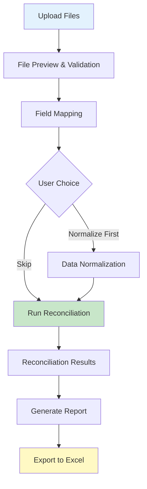
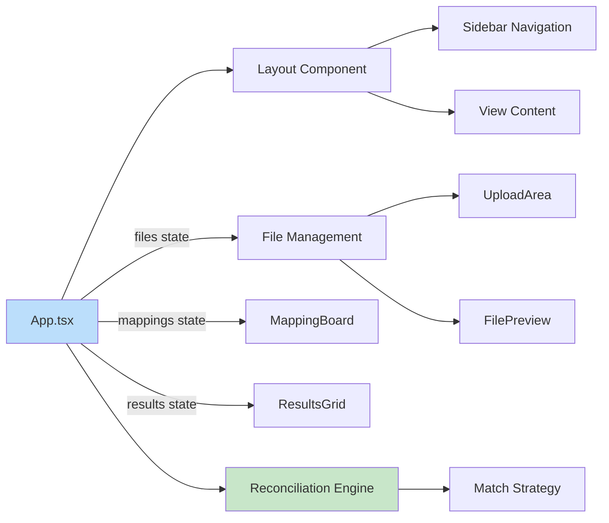

# SeeEyeReconciler - Architecture Documentation

## Overview

SeeEyeReconciler is a web-based data reconciliation application designed to compare, match, and reconcile discrepancies between two datasets (typically CSV or Excel files). The application provides an intuitive workflow for uploading files, mapping fields, normalizing data, and viewing reconciliation results.

**Project Name:** `cmdb_reconciler`  
**Application Type:** Single Page Application (SPA)  
**Primary Use Case:** CMDB (Configuration Management Database) data reconciliation and comparison

---

## Technology Stack

### Core Framework & Language
- **React 19.2.0** - UI component library
- **TypeScript 5.9.3** - Type-safe JavaScript
- **Vite 7.2.2** - Build tool and development server

### Styling & UI
- **TailwindCSS 3.4.18** - Utility-first CSS framework
- **CSS Variables** - Custom theming system
- **Framer Motion 12.23.24** - Animation library
- **Lucide React 0.554.0** - Icon library

### Data Processing
- **XLSX 0.18.5** - Excel file parsing and export

### Development Tools
- **ESLint 9.39.1** - Code linting
- **TypeScript ESLint** - TypeScript-specific linting rules
- **PostCSS & Autoprefixer** - CSS processing

---

## Project Structure

```
cmdb_reconciler/
├── public/              # Static assets (logo, favicon)
├── src/
│   ├── assets/          # Application assets (logo, images)
│   ├── components/      # Reusable UI components
│   │   ├── Button.tsx
│   │   ├── Layout.tsx
│   │   ├── Sidebar.tsx
│   │   ├── ThemeContext.tsx
│   │   ├── ThemeToggle.tsx
│   │   └── ui/          # Lower-level UI primitives
│   ├── features/        # Feature modules (domain-driven)
│   │   ├── dashboard/
│   │   ├── file-management/
│   │   ├── mapping/
│   │   ├── matching/
│   │   ├── normalization/
│   │   ├── results/
│   │   └── settings/
│   ├── logic/           # Business logic layer
│   │   ├── normalization/
│   │   └── reconciliation/
│   ├── styles/          # Global styles and CSS variables
│   ├── utils/           # Utility functions
│   ├── App.tsx          # Main application component
│   └── main.tsx         # Application entry point
├── package.json
├── vite.config.ts
├── tailwind.config.js
└── tsconfig.json
```

---

## Architecture Patterns

### 1. Feature-Based Organization

The codebase follows a **feature-based architecture** where related functionality is grouped into self-contained modules under the `src/features/` directory. Each feature module encapsulates its own components, types, and business logic.

**Features:**
- **dashboard** - Home dashboard with job statistics
- **file-management** - File upload, preview, and management
- **mapping** - Field mapping between source and target datasets
- **matching** - Reconciliation execution interface
- **normalization** - Data normalization workflow
- **results** - Results grid and visualization
- **settings** - Application settings and preferences

### 2. Separation of Concerns

The application maintains clear separation between:

- **Presentation Layer** (`src/components/`, `src/features/*/`)
  - React components for UI rendering
  - Component-specific types and interfaces
  
- **Business Logic Layer** (`src/logic/`)
  - `reconciliation/` - Reconciliation algorithms and strategies
  - `normalization/` - Data normalization logic
  
- **Utility Layer** (`src/utils/`)
  - Cross-cutting concerns (file parsing, export, fuzzy matching, data normalization)
  - Shared utilities used across features

### 3. Strategy Pattern for Reconciliation

The reconciliation engine implements the **Strategy Pattern** to support multiple matching algorithms:

```typescript
// src/logic/reconciliation/ReconciliationEngine.ts
class ReconciliationEngine {
  constructor(strategy: 'exact' | 'fuzzy') {
    // Strategy selection
  }
  
  reconcile(sourceFile, targetFile, config) {
    // Delegates to appropriate strategy
  }
}
```

**Strategies:**
- **Exact Match Strategy** - Precise field-by-field comparison
- **Fuzzy Match Strategy** - Levenshtein distance-based matching with configurable threshold

This design allows easy addition of new matching strategies (e.g., phonetic matching, ML-based matching) without modifying existing code.

### 4. State Management

The application uses **React's built-in state management** with `useState` hooks in the main `App.tsx` component:

```typescript
const [currentView, setCurrentView] = useState<View>('home');
const [files, setFiles] = useState<UploadedFile[]>([]);
const [mappings, setMappings] = useState<FieldMapping[]>([]);
const [normalizedData, setNormalizedData] = useState<NormalizedDataset | null>(null);
const [results, setResults] = useState<ReconciliationResult | null>(null);
const [strategy, setStrategy] = useState<'exact' | 'fuzzy'>('fuzzy');
```

**State Flow:**
1. Files uploaded → `files` state updated
2. User creates mappings → `mappings` state updated
3. Normalization performed → `normalizedData` state updated
4. Reconciliation executed → `results` state updated

State is passed down to child components via props, following a **unidirectional data flow** pattern.

### 5. View-Based Navigation

The application implements a custom **state-based routing** system without using React Router:

```typescript
type View = 'home' | 'datasource' | 'mapping' | 'normalization' | 
            'reconciliation' | 'report' | 'settings';

const renderContent = () => {
  switch (currentView) {
    case 'home': return <Home />;
    case 'datasource': return <DataSourceView />;
    // ... other views
  }
};
```

This approach provides:
- Simplified navigation for a linear workflow
- No URL management overhead
- Complete control over navigation logic

### 6. Theme System

The application implements a **theme system** using:
- **Context API** (`ThemeContext.tsx`) for theme state management
- **CSS Variables** for dynamic theming
- **LocalStorage persistence** for theme preferences

```typescript
// ThemeContext provides theme state across the app
<ThemeProvider>
  <Layout>
    {/* App content */}
  </Layout>
</ThemeProvider>
```

---

## Data Flow

### Reconciliation Workflow



### Component Data Flow



---

## Key Features

### 1. File Management
**Location:** `src/features/file-management/`

- **File Upload** - Drag-and-drop or click-to-browse interface
- **File Preview** - Tabular preview of uploaded data
- **File Validation** - Ensures exactly 2 files (source and target)
- **File Swapping** - Ability to swap source/target designation
- **Data Table Viewer** - Full-featured data viewer with sorting, filtering, and pagination

**Components:**
- `UploadArea.tsx` - File upload interface
- `FilePreview.tsx` - File list and preview
- `DataViewerModal.tsx` - Modal with comprehensive data table
- `DataTable.tsx` - Sortable, filterable, paginated table component

### 2. Field Mapping
**Location:** `src/features/mapping/`

- Maps columns from source file to target file
- Designate key fields for matching
- Visual mapping board interface
- Supports multiple mapping configurations

**Components:**
- `MappingBoard.tsx` - Visual field mapping interface

### 3. Data Normalization
**Location:** `src/features/normalization/`

- Combines source and target data into unified format
- Applies transformations and standardizations
- Generates normalized dataset for comparison

**Components:**
- `NormalizationBoard.tsx` - Normalization configuration interface

### 4. Reconciliation Engine
**Location:** `src/logic/reconciliation/`

**Core Algorithm:**
1. Generate composite keys from mapped key fields
2. Apply selected matching strategy (exact or fuzzy)
3. Categorize records:
   - **Matched** - Records found in both datasets
   - **Conflicts** - Records with key matches but value differences
   - **Orphans** - Records unique to source or target

**Match Types:**
- **Exact Match** - Direct field-by-field comparison
- **Fuzzy Match** - Levenshtein distance-based with 0.8 default threshold

### 5. Results Visualization
**Location:** `src/features/results/`

- **Results Grid** - Displays matched, conflicted, and orphaned records
- **Expandable Rows** - Side-by-side comparison of source/target records
- **Difference Highlighting** - Visual indicators for field-level differences
- **Summary Statistics** - Total, matched, conflicts, orphans count

**Components:**
- `ResultsGrid.tsx` - Interactive results table with expand/collapse

### 6. Report Generation
**Location:** `src/utils/exportHandler.ts`

- Export reconciliation results to Excel
- Multiple sheets: Matched, Conflicts, Source Orphans, Target Orphans
- Formatted output with summary statistics

### 7. Dashboard
**Location:** `src/features/dashboard/`

- Summary statistics (total reconciliations, success rate)
- Recent jobs list with status
- Quick navigation to workflow steps

**Components:**
- `Home.tsx` - Dashboard landing page

---

## Data Models

### Core Types

**UploadedFile** (`src/features/file-management/types.ts`)
```typescript
interface UploadedFile {
  id: string;
  name: string;
  data: Record<string, any>[];
  headers: string[];
  role: 'source' | 'target';
}
```

**FieldMapping** (`src/features/mapping/types.ts`)
```typescript
interface FieldMapping {
  sourceField: string;
  targetField: string;
  isKey: boolean;
}
```

**ReconciliationResult** (`src/features/matching/types.ts`)
```typescript
interface ReconciliationResult {
  matched: Match[];
  conflicts: Conflict[];
  orphans: {
    source: Orphan[];
    target: Orphan[];
  };
  summary: {
    total: number;
    matched: number;
    conflicts: number;
    orphans: { source: number; target: number };
  };
}
```

---

## Design Decisions

### 1. Why No React Router?
The application implements a linear workflow (Home → Data Source → Mapping → Normalization → Reconciliation → Report). State-based navigation is simpler and provides better control over the workflow progression without the overhead of URL management.

### 2. Why Strategy Pattern for Reconciliation?
Anticipating future requirements for additional matching algorithms (phonetic, ML-based, custom business rules), the Strategy Pattern provides extensibility without modifying the core engine.

### 3. Why Feature-Based Organization?
As the application grows, feature-based organization:
- Improves code discoverability
- Reduces cognitive load (related code is co-located)
- Enables easier feature extraction or removal
- Supports team scaling (features can be assigned to different developers)

### 4. Why CSS Variables + Tailwind?
- **CSS Variables** - Enable dynamic theming (light/dark mode) without rebuilding
- **Tailwind** - Provides utility classes for rapid UI development
- **Combination** - Best of both worlds: rapid development with dynamic theming

### 5. Why Vite Over Create React App?
- Faster development server (ES modules, no bundling in dev)
- Faster build times
- Better TypeScript support out-of-the-box
- Modern tooling ecosystem

---

## Performance Considerations

### Current Limitations
1. **Large Dataset Handling** - Currently loads entire datasets into memory
2. **Results Display** - Previously capped at 100 records (may have been addressed with virtual scrolling)

### Optimization Strategies
- **Virtual Scrolling** - For large result sets (DataTable component)
- **Pagination** - Server-side pagination for massive datasets
- **Web Workers** - Move reconciliation logic to background thread
- **Incremental Processing** - Stream-based processing for very large files

---

## Extensibility Points

### Adding New Match Strategies
1. Create new strategy in `src/logic/reconciliation/strategies/`
2. Implement the strategy interface
3. Register in `ReconciliationEngine.ts`
4. Add UI toggle in mapping view

### Adding New File Formats
1. Extend `fileParser.ts` to support new format
2. Update `UploadedFile` type if needed
3. Add format validation in `UploadArea`

### Adding New Normalization Rules
1. Create normalization rule in `src/logic/normalization/`
2. Integrate with `NormalizationBoard.tsx`
3. Update `NormalizedDataset` type

---

## Security Considerations

### Current Implementation
- **Client-Side Processing** - All data processing happens in browser
- **No Server Communication** - Files never leave user's machine
- **Privacy-First** - Sensitive data remains local

### Future Enhancements
- Input sanitization for file uploads
- CSP (Content Security Policy) headers
- File size limits enforcement
- File type validation hardening

---

## Testing Strategy

### Recommended Test Coverage
1. **Unit Tests**
   - Reconciliation strategies (`ExactMatchStrategy`, `FuzzyMatchStrategy`)
   - Utility functions (`fuzzyMatch`, `dataNormalizer`, `fileParser`)
   - Business logic in `src/logic/`

2. **Integration Tests**
   - Complete reconciliation workflow
   - File upload → mapping → reconciliation → export

3. **Component Tests**
   - Individual feature components
   - Theme toggling
   - Data table interactions

### Test Files to Create
- `src/logic/reconciliation/__tests__/`
- `src/utils/__tests__/`
- `src/features/**/__tests__/`

---

## Future Enhancements

### Planned Features
1. **Advanced Filtering** - Pre-reconciliation data filtering
2. **Custom Reconciliation Rules** - User-defined matching logic
3. **Batch Processing** - Multiple file pair reconciliation
4. **History & Versioning** - Track reconciliation history
5. **Collaborative Features** - Share reconciliation results
6. **API Integration** - Direct database/API connections
7. **Machine Learning** - AI-assisted field mapping and matching

### Technical Debt
1. Update README.md with project-specific documentation
2. Add comprehensive test suite
3. Implement error boundaries for better error handling
4. Add loading states for async operations
5. Implement proper logging and telemetry

---

## Development Workflow

### Running Locally
```bash
# Install dependencies
npm install

# Start development server
npm run dev

# Build for production
npm run build

# Preview production build
npm run preview

# Run linter
npm run lint
```

### Development Server
- **URL:** `http://localhost:5173` (default Vite port)
- **Hot Module Replacement (HMR)** - Instant updates on file changes

---

## Conclusion

SeeEyeReconciler is a well-architected, modern React application with clear separation of concerns, extensible design patterns, and a user-friendly workflow for data reconciliation. The feature-based organization and strategy pattern implementation provide a solid foundation for future enhancements and scaling.
